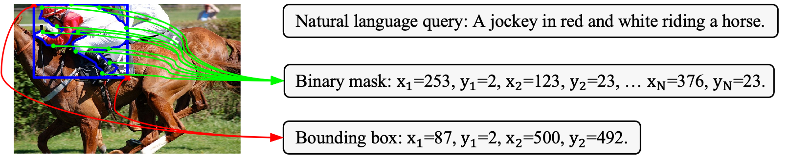

# SeqTR

  

This is the official implementation of [SeqTR: A Simple yet Universal Network for Visual Grounding](https://arxiv.org/abs/2203.16265), which simplifies and unifies the modelling for visual grounding tasks under a novel point prediction paradigm. 

<!-- To this end, different grounding tasks can be tackled in one network with the simple cross-entropy loss. We surpass or maintain on par with state-of-the-arts, and also outperform a set of larget-scale pre-trained models with much less expenditure, suggesting a simple and universal approach is indeed feasible. -->

## Installation

### Prerequisites

```
pip install -r requirements.txt
wget https://github.com/explosion/spacy-models/releases/download/en_vectors_web_lg-2.1.0/en_vectors_web_lg-2.1.0.tar.gz -O en_vectors_web_lg-2.1.0.tar.gz
pip install en_vectors_web_lg-2.1.0.tar.gz
```
Then install SeqTR package in editable mode:
```
pip install -e .
```

### Data Preparation

1. Download our [preprocessed json files](https://drive.google.com/drive/folders/1IXnSieVr5CHF2pVJpj0DlwC6R3SbfolU?usp=sharing) including the merged dataset for pre-training, and [DarkNet-53 model weights](https://drive.google.com/drive/folders/1W8y_WS-8cnuU0LnF8e1v8ZowZvpEaolk?usp=sharing) trained on MS-COCO object detection task.
2. Download the train2014 images from [Joseph Redmon's mscoco mirror](https://pjreddie.com/projects/coco-mirror/), original [Flickr30K images](http://shannon.cs.illinois.edu/DenotationGraph/), [ReferItGame images](https://drive.google.com/file/d/1R6Tm7tQTHCil6A_eOhjudK3rgaBxkD2t/view?usp=sharing), and [Visual Genome images](http://visualgenome.org/api/v0/api_home.html).

The project structure should look like the following:

```
| -- SeqTR
     | -- data
        | -- annotations
            | -- flickr30k
                | -- instances.json
                | -- ix_to_token.pkl
                | -- token_to_ix.pkl
                | -- word_emb.npz
            | -- referitgame-berkeley
            | -- refcoco-unc
            | -- refcocoplus-unc
            | -- refcocog-umd
            | -- refcocog-google
            | -- mixed
        | -- weights
            | -- darknet.weights
            | -- yolov3.weights
        | -- images
            | -- mscoco
                | -- train2014
                    | -- COCO_train2014_000000000072.jpg
                    | -- ...
            | -- saiaprtc12
                | -- 25.jpg
                | -- ...
            | -- flickr30k
                | -- 36979.jpg
                | -- ...
            | -- visual-genome
                | -- 2412112.jpg
                | -- ...
     | -- configs
     | -- seqtr
     | -- tools
     | -- teaser
```
Note that the darknet.weights excludes val/test images of RefCOCO/+/g datasets while yolov3.weights does not.

## Training

### Phrase Localization and Referring Expression Comprehension

We train SeqTR to perform grouning at bounding box level on a single V100 GPU with 32 GB memory. The following script performs the training:
```
python tools/train.py configs/seqtr/detection/seqtr_det_[DATASET_NAME].py --cfg-options ema=True
```
[DATASET_NAME] is one of "flickr30k", "referitgame-berkeley", "refcoco-unc", "refcocoplus-unc", "refcocog-umd", and "refcocog-google".

### Referring Expression Segmentation

To train SeqTR to generate the target sequence of ground-truth mask, which is then assembled into the predicted mask by connecting the points, run the following script:

```
python tools/train.py configs/seqtr/segmentation/seqtr_mask_[DATASET_NAME].py --cfg-options ema=True
```

Note that instead of sampling 18 points and does not shuffle the sequence for RefCOCO dataset, for RefCOCO+ and RefCOCOg, we uniformly sample 12 points on the mask contour and randomly shffle the sequence with 20% percentage. Therefore, to execute the training on RefCOCO+/g datasets, modify **num_ray at line 1 to 18** and **model.head.shuffle_fraction to 0.2 at line 35**, in configs/seqtr/segmentation/seqtr_mask_darknet.py.

## Evaluation

```
python tools/test.py [PATH_TO_CONFIG_FILE] --load-from [PATH_TO_CHECKPOINT_FILE] --cfg-options ema=True
```

The script will evaluate both the performance of the model trained with and without EMA. 

## Pre-training + fine-tuning

We pre-train SeqTR on 8 V100 GPUs with 32 GB memory:
 
```
bash tools/dist_train.sh configs/seqtr/detection/seqtr_det_mixed.py 8 --cfg-options scheduler_config.max_epoch=15 scheduler_config.decay_steps=[12] scheduler_config.warmup_epochs=1
```

Then we fine-tune 5 epochs on down-stream datasets:

```
python tools/train.py configs/seqtr/detection/seqtr_det_[DATASET_NAME].py --finetune-from [PATH_TO_PRETRAINED_CHECKPOINT] --cfg-options scheduler_config.max_epoch=5 scheduler_config.decay_steps=[4] scheduler_config.warmup_epochs=0
```

Note that both during pre-training and fune-tuning stage, we disable Large Scale Jittering (LSJ) and Exponential Moving Average (EMA), so be cautious whether the LSJ is enabled or not during your fine-tuning stage. For example, one must comment out line 9-10 in configs/\_base\_/datasets/detection/refcoco-unc.py and do not comment out line 11, also, for evaluation, you should not add --cfg-options ema=True or set it to False.

## Models

### RefCOCO

<table>
<tr>
<td></td><td align="center">val</td><td align="center">testA</td><td align="center">testB</td><td align="center">url</td>
</tr>
<tr>
<td>SeqTR detection</td><td align="center">81.23</td><td align="center">85.00</td><td align="center">76.08</td><td align="center"><a href="https://pan.baidu.com/s/1m70hE43XTqpUPaZ8rbPSDg?pwd=hh3q">model & log</a></td>
</tr>
<tr>
<td>SeqTR* detection</td><td align="center">83.72</td><td align="center">86.51</td><td align="center">81.24</td><td align="center"><a href="https://pan.baidu.com/s/1QlisArPe8_XIxBLOzY247A?pwd=of7w">model & log</a></td>
</tr>
<tr>
<td>pre-trained + fine-tuned SeqTR detection</td><td align="center">87.00</td><td align="center">90.15</td><td align="center">83.59</td><td align="center"><a href="https://pan.baidu.com/s/1nC-DtTlAesSXYjUFzOnG6A?pwd=wknb">model & log</a></td>
</tr>
<tr>
<td>SeqTR segmentation</td><td align="center">67.26</td><td align="center">69.79</td><td align="center">64.12</td><td align="center"><a href="https://pan.baidu.com/s/1FEHxWwkhbN6ouwtSG3K2Tg?pwd=j978">model & log</a></td>
</tr>
<tr>
<td>pre-trained + fine-tuned SeqTR segmentation</td><td align="center">71.70</td><td align="center">73.31</td><td align="center">69/82</td><td align="center"><a href="">-</a></td>
</tr>
</table>

### RefCOCO+

<table>
<tr>
<td></td><td align="center">val</td><td align="center">testA</td><td align="center">testB</td><td align="center">url</td>
</tr>
<tr>
<td>SeqTR detection</td><td align="center">68.82</td><td align="center">75.37</td><td align="center">58.78</td><td align="center"><a href="https://pan.baidu.com/s/10IXsNKDbsZ_zba8tQZPgkg?pwd=1vw8">model & log</a></td>
</tr>
<tr>
<td>SeqTR* detection</td><td align="center">71.45</td><td align="center">76.26</td><td align="center">64.88</td><td align="center"><a href="https://pan.baidu.com/s/1aa7fBWtOiaBlTYb7Tig6iw?pwd=o5vd">model & log</a></td>
</tr>
<tr>
<td>pre-trained + fine-tuned SeqTR detection</td><td align="center">78.69</td><td align="center">84.51</td><td align="center">71.87</td><td align="center"><a href="">-</a></td>
</tr>
<tr>
<td>SeqTR segmentation</td><td align="center">54.14</td><td align="center">58.93</td><td align="center">48.19</td><td align="center"><a href="">-</a></td>
</tr>
<tr>
<td>pre-trained + fine-tuned SeqTR segmentation</td><td align="center">63.04</td><td align="center">66.73</td><td align="center">58.97</td><td align="center"><a href="">-</a></td>
</tr>
</table>

### RefCOCOg

<table>
<tr>
<td></td><td align="center">val-g</td><td align="center">url</td><td align="center">val-u</td><td align="center">test-u</td><td align="center">url</td>
</tr>
<tr>
<td>SeqTR detection</td><td align="center">-</td><td align="center">-</td><td align="center">71.35</td><td align="center">71.58</td><td align="center"><a href="https://pan.baidu.com/s/1fObNiIxgWrBy31AkXj9krg?pwd=b6ji">model & log</a></td>
</tr>
<tr>
<td>SeqTR* detection</td><td align="center">71.50</td><td align="center"><a href="https://pan.baidu.com/s/1v_fEGMWVXPoQKueBoXcjDQ?pwd=d1kp">model & log</a></td><td align="center">74.86</td><td align="center">74.21</td><td align="center"><a href="https://pan.baidu.com/s/1g-3XdzLow27pcIUug2KuhA?pwd=23tj">model & log</a></td>
</tr>
<tr>
<td>pre-trained + fine-tuned SeqTR detection</td><td align="center">-</td><td align="center"><a>-</a></td><td align="center">82.69</td><td align="center">83.37</td><td align="center"><a href="https://pan.baidu.com/s/1-0a_qz8bHTzdbIsN5mDaOg?pwd=pji5">model & log</a></td>
</tr>
<tr>
<td>SeqTR segmentation</td><td align="center">-</td><td align="center">-</td><td align="center">55.67</td><td align="center">55.64</td><td align="center"><a href="https://pan.baidu.com/s/18G6SSuEwEn0XtNEnj9taIg?pwd=ptpm">model & log</a></td>
</tr>
<tr>
<td>pre-trained + fine-tuned SeqTR segmentation</td><td align="center">-</td><td align="center">-</td><td align="center">64.69</td><td align="center">65.74</td><td align="center"><a href="https://pan.baidu.com/s/1l-g4ji2T139MFxSBSOEGFQ?pwd=r36v">model & log</a></td>
</tr>
</table>

SeqTR* denotes that its visual encoder is initialized with yolov3.weights, while the visual encoder of the rest are initialized with darknet.weights.

## Contributing

Our codes are highly modularized and flexible to be extended to new architectures,. For instance, one can [register new components](https://mmdetection.readthedocs.io/en/v2.21.0/tutorials/customize_models.html) such as head, fusion to promote your research ideas, or register new data augmentation techniques just as in mmdetection library. Feel free to play :-).

## Citation

```
@article{zhu2022seqtr,
  title={SeqTR: A Simple yet Universal Network for Visual Grounding},
  author={Zhu, ChaoYang and Zhou, YiYi and Shen, YunHang and Luo, Gen and Pan, XingJia and Lin, MingBao and Chen, Chao and Cao, LiuJuan and Sun, XiaoShuai and Ji, RongRong},
  journal={arXiv preprint arXiv:2203.16265},
  year={2022}
}
```

## Acknowledgement

Our code is built upon the open-sourced [mmcv](https://github.com/open-mmlab/mmcv) and [mmdetection](https://github.com/open-mmlab/mmdetection) libraries. 