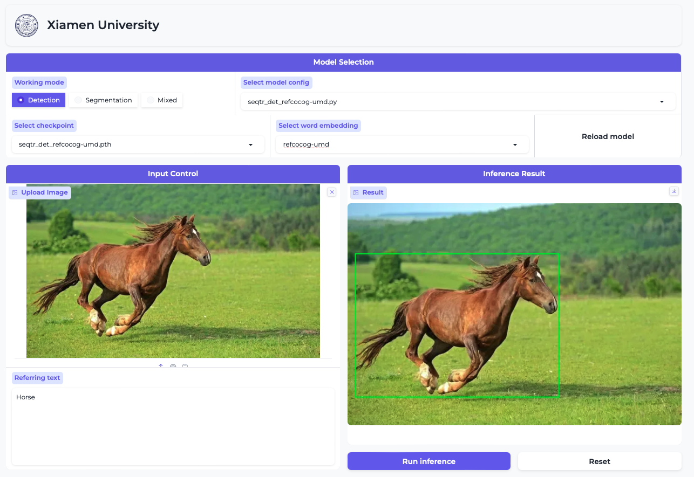

# SegTR Demo



## Installation

1. Please refer to the [Installation](../README.md#installation) section to complete the model environment deployment.

2. Make sure the `gradio` package is installed:
   ```bash
   pip install gradio
   ```
3. Download the pretrained checkpoints from [Models](../README.md#models), and place it to some directory(`ckpt` for default). To better identify the checkpoint, please change the filename after downloading.
4. launch the `webui.py` to use
   ```bash
   python demo/webui.py --ckpt_dir YOUR_CHECKPOINT_DIR
   ```
   Noted that the `YOUR_CHECKPOINT_DIR` is the checkpoint directory(`ckpt` for default).
